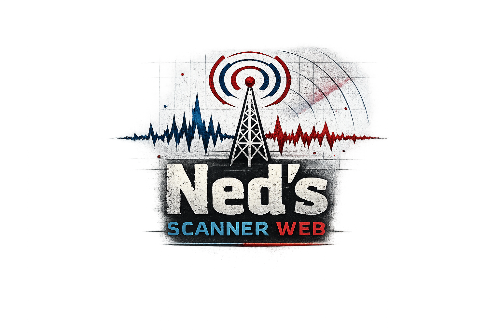
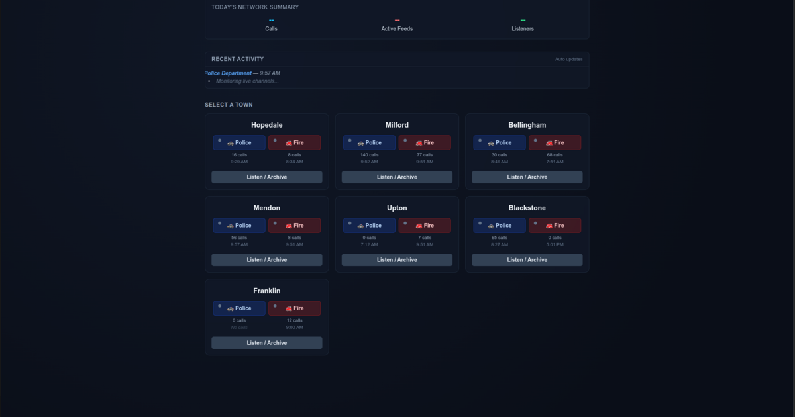
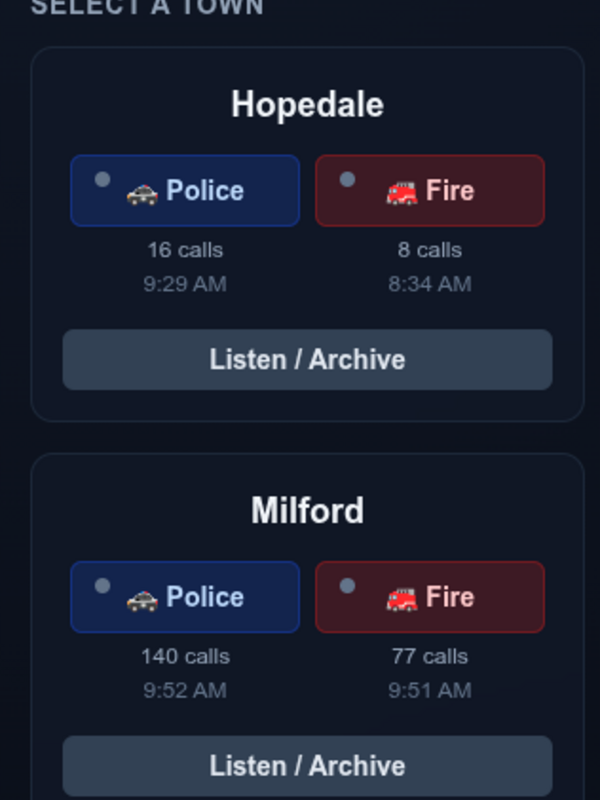

<p align="center">
  
</p>

<h1 align="center">Ned's Scanner Network</h1>

<p align="center">
  <b>Open-source, self-hosted scanner radio pipeline — capture over-the-air transmissions, transcribe them with GPU-accelerated Whisper, and serve everything through a real-time web UI.</b>
</p>

<p align="center">
  
  
  
  
  
  
</p>

---

<p align="center">
  
</p>
<p align="center">
  
</p>

---

## What This Does

**Ned's Scanner Network** is a complete, end-to-end pipeline that turns RTL-SDR radio dongles (or any audio source) into a searchable, browsable, real-time scanner feed with AI transcripts — all running on a single Linux box.

| Stage | What happens |
|-------|-------------|
| **🔌 Receive** | RTL-SDR dongles feed `rtl_tcp` servers → SDR++ (or any SDR app) demodulates and pushes audio to PulseAudio/PipeWire sinks |
| **🎙️ Record** | A bash pipeline captures audio from PulseAudio monitor sources, segments speech from silence with `sox`, and publishes each new call to a Redis Stream |
| **🧠 Transcribe** | A Redis listener picks up new calls and routes them to a long-lived MCP server holding a warm, fine-tuned Whisper model on GPU — no cold loads, sub-second latency |
| **📊 Enrich** | Regex NLP extracts addresses, unit IDs, agencies, tone, and urgency from each transcript; quality scoring flags bad audio for retry |
| **🌐 Serve** | A Flask + Socket.IO web app pushes live calls to connected browsers in real time, with full archive search, per-town views, stats dashboards, and Web Push notifications |

### Receiver-Agnostic Design

The pipeline is **deliberately decoupled from the receiver**. Right now it uses SDR++ pushing audio into PulseAudio null sinks, but the recorder only cares about a PulseAudio monitor source name. You could swap in:

- **Gqrx, CubicSDR, or any SDR app** that outputs to PulseAudio/PipeWire
- **A network audio stream** (via `ffmpeg` piping to a Pulse sink)
- **A hardware scanner** with line-out into your sound card
- **A remote `rtl_tcp` instance** on another machine
- **Any process** that produces audio on a named PulseAudio source

As long as audio arrives at the configured Pulse monitor source, the rest of the pipeline works unchanged.

---

## Architecture

```
┌─────────────────────────────────────────────────────────────────────────┐
│  RTL-SDR Dongles  ──→  rtl_tcp@{port}.service (one per dongle)        │
│         │                                                               │
│         ▼                                                               │
│  SDR++ (demod)  ──→  PulseAudio null sinks (one per channel)          │
│         │                                                               │
│         ▼                                                               │
│  ┌──────────────────────────────────────────────────────────────────┐  │
│  │  RECORDER  (bash)                                                │  │
│  │  ffmpeg → sox silence split → inotify watcher                    │  │
│  │    → atomic move to archive/clean/<feed>/                        │  │
│  │    → Redis XADD scanner:stream:new_call                          │  │
│  └──────────────────────────────────────────────────────────────────┘  │
│         │  Redis Stream                                                 │
│         ▼                                                               │
│  ┌──────────────────────────────────────────────────────────────────┐  │
│  │  TRANSCRIBER LISTENER  (Python)                                  │  │
│  │  Redis XREADGROUP → MCP client call to warm GPU server           │  │
│  └──────────────────────────────────────────────────────────────────┘  │
│         │  MCP (streamable HTTP)                                        │
│         ▼                                                               │
│  ┌──────────────────────────────────────────────────────────────────┐  │
│  │  MCP SERVER  (Python — long-lived, warm Whisper on GPU)          │  │
│  │  Fine-tuned Whisper medium → multi-profile retry                 │  │
│  │  → quality scoring → NLP enrichment → SQLite + JSON write        │  │
│  │  → Redis PUBLISH scanner:live:call (real-time fan-out)           │  │
│  └──────────────────────────────────────────────────────────────────┘  │
│         │  Redis PUB/SUB                                                │
│         ▼                                                               │
│  ┌──────────────────────────────────────────────────────────────────┐  │
│  │  WEB SERVER  (Flask + Socket.IO + Eventlet)                      │  │
│  │  Live feed dashboard │ Archive browser │ Town views              │  │
│  │  Full-text search │ Stats & analytics │ Push notifications       │  │
│  │  PWA (installable) │ Transcript editing │ Intent labeling        │  │
│  └──────────────────────────────────────────────────────────────────┘  │
└─────────────────────────────────────────────────────────────────────────┘
```

---

## Features

### Transcription & AI
- 🎯 **Fine-tuned Whisper medium** — trained on real scanner audio for dramatically better accuracy on radio jargon, unit codes, and addresses
- 🔥 **Warm GPU model** — model stays loaded in VRAM; new calls transcribe in ~1–3 seconds
- 🔄 **Multi-profile retry** — if the first transcription scores poorly, automatically retries with different decoding parameters
- 📊 **Quality scoring** — each transcript gets a confidence score; low-quality calls are flagged for human review
- 🏷️ **NLP enrichment** — regex-based extraction of addresses, responding units, agency names, tone, and urgency level
- 🔒 **GPU mutex** — Redis-backed cross-process CUDA lock prevents VRAM thrash when multiple GPU consumers are running

### Web UI
- ⚡ **Real-time feed** — new calls appear instantly via Socket.IO, no page refresh
- 🏘️ **Per-town views** — browse calls by municipality and department
- 🔍 **Full-text search** — search across all transcripts
- 📈 **Stats dashboard** — call volume, active feeds, disk usage, hourly activity charts
- 📦 **7-day archive browser** — paginated, filterable call history with inline audio playback
- ✏️ **Transcript editing** — correct transcripts directly in the browser to build training data
- 🏷️ **Intent labeling** — tag calls with intents and dispositions for future model training
- 🔔 **Web Push notifications** — per-channel push alerts (VAPID-based, works on mobile)
- 📱 **Installable PWA** — works as a standalone app on phones and desktops
- 🌙 **Dark theme** — clean, glassmorphic UI built with Tailwind CSS

### Infrastructure
- 🔴 **Redis as the backbone** — streams for call delivery, pub/sub for live updates, keys for state and caching
- 🗃️ **SQLite (WAL mode)** — single shared database with concurrent reader support
- 🛠️ **systemd user services** — every component runs as a managed service with auto-restart
- 📋 **Structured logging** — RotatingFileHandler + JSON logging across all components
- 🧩 **MCP (Model Context Protocol)** — the transcription server exposes tools via FastMCP, making it composable with any MCP-compatible client
- 📂 **Environment-driven config** — all paths, URLs, and secrets loaded from `.env` files; no hardcoded user paths in application logic

---

## Project Structure

```
.
├── .env                        # Root shared environment (DB path, archive, Redis)
├── .env_example                # Template for .env
├── .gitignore
│
├── shared/                     # Shared Python library
│   ├── __init__.py
│   └── scanner_db.py           # Unified DB layer (schema, queries, CLI)
│
├── record/                     # Audio capture
│   ├── multi_scanner_recorder_with_redis.sh   # Multi-channel recorder
│   ├── .env                    # Recorder-specific config
│   └── README.md
│
├── transcriber/                # AI transcription pipeline
│   ├── scanner_transcriber_mcp.py            # MCP server (warm Whisper on GPU)
│   ├── transcribe_stream_listener_mcp.py     # Redis stream → MCP client
│   ├── nlp_zero_shot.py                      # Regex metadata enrichment
│   ├── gpu_gate.py                           # Redis-backed GPU mutex
│   ├── scanner_db.py                         # (legacy, use shared/)
│   └── .env
│
├── web/                        # Web frontend + API
│   ├── app_socket2.py          # Flask + Socket.IO entry point
│   ├── sockets.py              # WebSocket event handlers
│   ├── client_tracker.py       # Session tracking
│   ├── user_logger.py          # User activity audit log
│   ├── push_db.py              # Web Push subscription store
│   ├── push_utils.py           # VAPID push delivery
│   ├── scanner_db.py           # (legacy, use shared/)
│   ├── routes/
│   │   ├── routes_scanner.py   # Main scanner routes (feeds, archive, stats)
│   │   ├── routes_api_scanner.py  # JSON API endpoints
│   │   ├── routes_auth.py      # Authentication proxy
│   │   └── routes_push.py      # Push notification routes
│   ├── templates/              # Jinja2 HTML templates
│   ├── static/
│   │   ├── js/                 # Client-side app logic
│   │   ├── css/
│   │   ├── icons/
│   │   ├── screenshots/
│   │   ├── manifest.json       # PWA manifest
│   │   └── sw.js               # Service worker
│   └── .env
│
├── scripts/
│   └── rtl_wrapper.sh          # RTL-TCP device↔port mapper
│
├── tools/
│   └── scanner_dashboard.py    # Textual TUI for service management
│
└── user_services/              # systemd user service files
    ├── rtl_tcp@.service        # Template: one rtl_tcp per dongle
    ├── scanner-mcp.service     # MCP transcription server
    ├── scanner-recorder.service
    ├── scanner-transcriber.service
    ├── scanner-websocket.service
    └── commands.md             # Quick systemctl reference
```

---

## Requirements

### Hardware
- **Linux box** (tested on Ubuntu 24.04 / Pop!_OS)
- **NVIDIA GPU** with ≥ 4 GB VRAM (RTX 3060 or better recommended)
- **RTL-SDR dongle(s)** — one per simultaneous frequency (or any audio source)

### Software
| Dependency | Purpose |
|-----------|---------|
| Python 3.12+ | All Python components |
| CUDA 12.x + cuDNN | GPU inference |
| Redis 7+ | Streams, pub/sub, state |
| FFmpeg | Audio capture from Pulse sources |
| SoX | Silence-based audio segmentation |
| inotify-tools | File system watcher for recorder |
| PulseAudio / PipeWire-Pulse | Audio routing |
| rtl_tcp / rtl-sdr | SDR dongle server (if using RTL-SDR) |
| SDR++ (optional) | Demodulation front-end |

### Python Packages
```
torch torchaudio transformers   # Whisper inference
flask flask-socketio eventlet   # Web server
redis python-dotenv             # Infrastructure
mcp                             # Model Context Protocol client/server
pywebpush cryptography          # Web Push notifications
textual                         # TUI dashboard (optional)
pytz python-dateutil requests beautifulsoup4 pythonjsonlogger apscheduler
```

---

## Quick Start

### 1. Clone & configure

```bash
git clone https://github.com/iamcalledned/neds_scanner_radio_full_repo.git
cd neds-scanner-network

# Copy and edit the root .env with your paths
cp .env_example .env
nano .env

# Do the same for each component
cp record/.env_example record/.env
cp transcriber/.env_example transcriber/.env
cp web/.env_example web/.env
```

### 2. Create a Python virtual environment

```bash
python3.12 -m venv ~/venv
source ~/venv/bin/activate
pip install torch torchaudio transformers flask flask-socketio eventlet \
            redis python-dotenv mcp pywebpush cryptography textual \
            pytz python-dateutil requests beautifulsoup4 \
            pythonjsonlogger apscheduler
```

### 3. Initialize the database

```bash
cd shared
python scanner_db.py create
```

### 4. Install systemd user services

```bash
# Copy service files
cp user_services/*.service ~/.config/systemd/user/
systemctl --user daemon-reload

# Start the full stack
systemctl --user start scanner-mcp.service
systemctl --user start scanner-transcriber.service
systemctl --user start scanner-recorder.service
systemctl --user start scanner-websocket.service
```

### 5. Open the web UI

Navigate to `http://your-host:5050/scanner/` — calls will appear in real time as audio is captured.

---

## How It Works — Step by Step

1. **RTL-SDR dongles** connect via USB. Each runs an `rtl_tcp` server on a unique port (12000, 12001, …).

2. **SDR++** (or your SDR app of choice) demodulates the RF signal and routes audio to **PulseAudio null sinks** — one per radio channel.

3. The **recorder** script (`multi_scanner_recorder_with_redis.sh`) listens to each Pulse monitor source via `ffmpeg`, pipes through `sox` for silence-based segmentation, and uses `inotifywait` to detect completed clips. Each clip is:
   - Moved to the archive (`scanner_archive/clean/<feed>/`)
   - Published to Redis Stream `scanner:stream:new_call`

4. The **transcriber listener** (`transcribe_stream_listener_mcp.py`) reads from the Redis Stream via a consumer group and makes an MCP tool call to the warm GPU server.

5. The **MCP server** (`scanner_transcriber_mcp.py`) keeps the fine-tuned Whisper model loaded in VRAM. For each call it:
   - Acquires the GPU mutex (prevents VRAM collisions)
   - Transcribes with the primary profile
   - Scores the transcript quality
   - Retries with alternate decoding parameters if needed
   - Enriches metadata (addresses, units, agency, tone, urgency)
   - Writes results to SQLite + JSON sidecar
   - Publishes to Redis pub/sub for live delivery

6. The **web server** (`app_socket2.py`) subscribes to Redis pub/sub and pushes new calls to all connected browsers via Socket.IO. It also sends Web Push notifications to subscribed devices.

---

## Service Management

The `tools/scanner_dashboard.py` provides a terminal UI for managing all services:

```bash
python tools/scanner_dashboard.py
```

Or use systemctl directly:

```bash
# Status of all scanner services
systemctl --user status scanner-mcp scanner-recorder scanner-transcriber scanner-websocket

# Restart everything
systemctl --user restart scanner-mcp scanner-recorder scanner-transcriber scanner-websocket

# View live logs
journalctl --user -u scanner-mcp -f
```

---

## Configuration

All configuration is driven by `.env` files — no hardcoded paths in application code.

### Root `.env` (shared by all components)
```dotenv
SCANNER_DB_PATH=/path/to/scanner_calls.db
ARCHIVE_BASE=/path/to/scanner_archive
REVIEW_DIR=/path/to/scanner_archive/review
REDIS_URL=redis://127.0.0.1:6379/0
LOG_LEVEL=INFO
```

### `transcriber/.env`
```dotenv
LOG_DIR=/path/to/logs/transcriber_logs
MCP_URL=http://127.0.0.1:8000/mcp
WHISPER_MODEL_DIR=/path/to/trained_whisper_medium
PYTORCH_CUDA_ALLOC_CONF=expandable_segments:True
```

### `web/.env`
```dotenv
SERVICE_NAME=scanner_web
APP_ENV=production
LOG_FILE=/path/to/logs/weblogs/scanner_web.log
```

### `record/.env`
```dotenv
ARCHIVE_BASE=/path/to/scanner_archive
LOG_DIR=/path/to/logs/recorder_logs
SAMPLE_RATE=48000
STOP_DUR=3.0
THRESH=0.2%
```

---

## API Endpoints

| Endpoint | Method | Description |
|----------|--------|-------------|
| `/scanner/` | GET | Main live feed dashboard |
| `/scanner/today` | GET | Today's calls view |
| `/scanner/archive` | GET | 7-day archive browser |
| `/scanner/town/<town>` | GET | Per-town call view |
| `/scanner/stats` | GET | Statistics dashboard |
| `/scanner/audio/<filename>` | GET | Serve audio file |
| `/scanner/submit_edit` | POST | Submit transcript correction |
| `/scanner/api/latest` | GET | Latest calls (JSON) |
| `/scanner/api/stats` | GET | Aggregate stats (JSON) |
| `/scanner/api/today_counts` | GET | Per-feed counts for today |
| `/scanner/api/call_activity` | GET | Hourly activity data |
| `/scanner/push/subscribe` | POST | Register for push notifications |

---

## Development Log

This project evolved from a simple "record scanner audio" script into a full production pipeline over several months of iterative development. Key milestones:

- **Recorder** — Started with a single-channel ffmpeg→sox script. Grew into a multi-channel, data-driven bash pipeline with Redis integration, atomic file moves, and per-channel staging directories.
- **Transcription** — Began with cold-loading Whisper per file (slow). Moved to a long-lived MCP server that keeps the model warm on GPU — transcription went from ~15s to ~1–3s per call.
- **Fine-tuning** — Trained a custom Whisper medium model on real scanner audio with corrected transcripts. Massive improvement on radio-specific vocabulary (unit codes, street names, 10-codes).
- **Quality scoring** — Added multi-profile retry with confidence scoring. Bad transcripts get automatically retried with different beam sizes, temperature, and prompt conditioning.
- **GPU mutex** — Built `gpu_gate.py` after hitting CUDA OOM crashes when transcription and other GPU tasks collided. Redis-backed distributed lock with NVML health checks.
- **Unified DB** — Merged two divergent `scanner_db.py` files into a single `shared/scanner_db.py` with superset schema, environment-driven config, and structured logging.
- **Web Push** — Added VAPID-based Web Push so you get notifications on your phone when your town has activity.
- **PWA** — Made the web app installable with a service worker, offline page, and app manifest.
- **Hardcoded path cleanup** — Replaced 50+ hardcoded `/home/ned/` paths across the codebase with `os.environ.get()` driven by `.env` files for portability.

---

## Contributing

This is a personal project that I'm sharing with the community. If you find it useful or want to adapt it for your own area:

1. Fork the repo
2. Create a feature branch (`git checkout -b feature/my-town`)
3. Commit your changes
4. Open a Pull Request

Ideas for contribution:
- Support for additional SDR backends (SoapySDR, etc.)
- Speaker diarization (who's talking?)
- Automatic dispatch type classification (ML-based)
- Mobile app wrapper
- Multi-node support (distributed recording)

---

## Support This Project

If you find this useful, learned something from it, or just think it's cool that someone pointed antennas at the sky and built an AI pipeline around it — consider buying me a coffee ☕

**Bitcoin (BTC):**
```
bc1qgay9y53823afdwtcmvztvj664ecmjp3pc3gr0f

```


## License

MIT — see [LICENSE](LICENSE) for details.

---

<p align="center">
  Built with 🎙️ + 🧠 + ☕ by <a href="https://github.com/iamcalledned">Ned</a>
</p>
