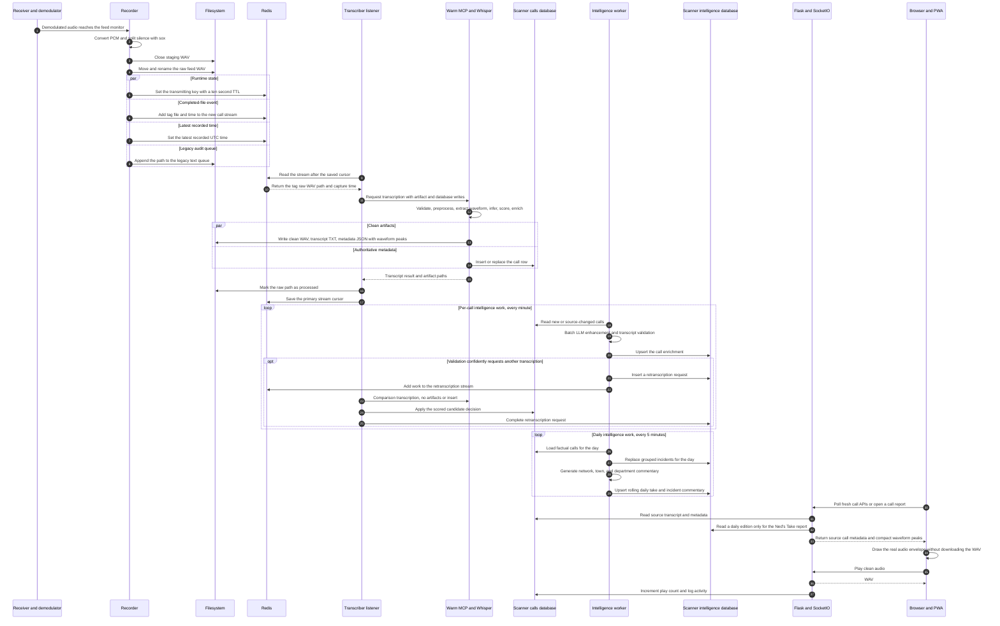
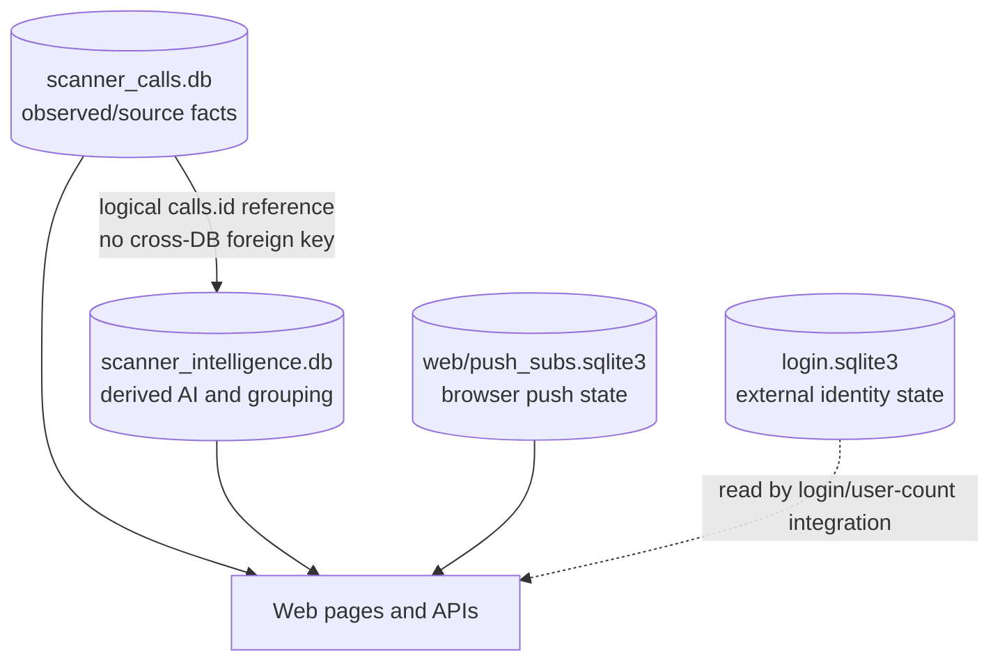
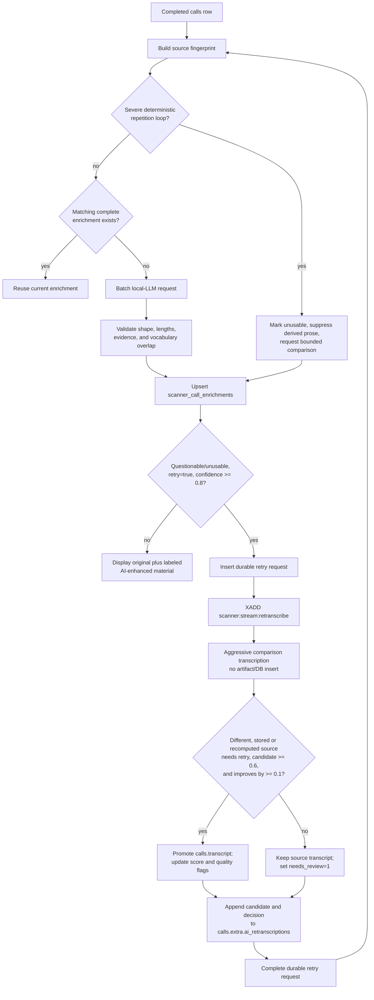
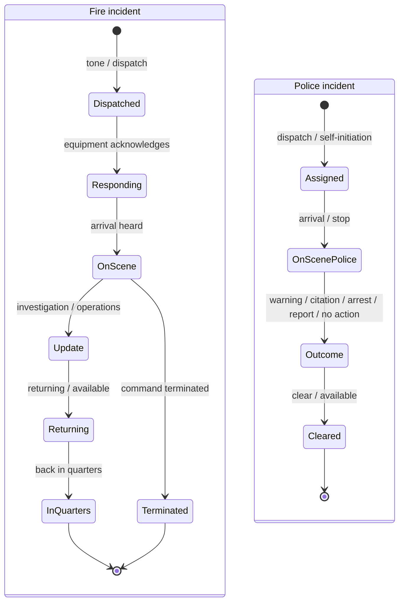
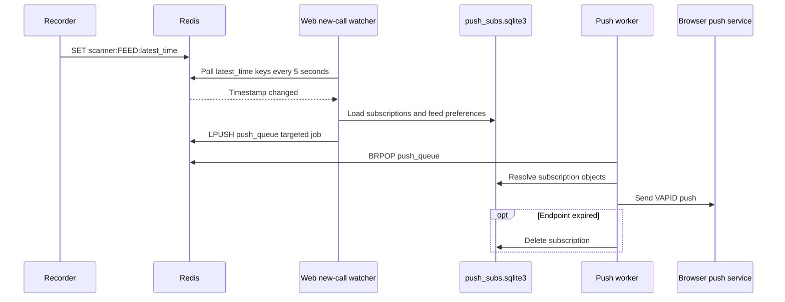
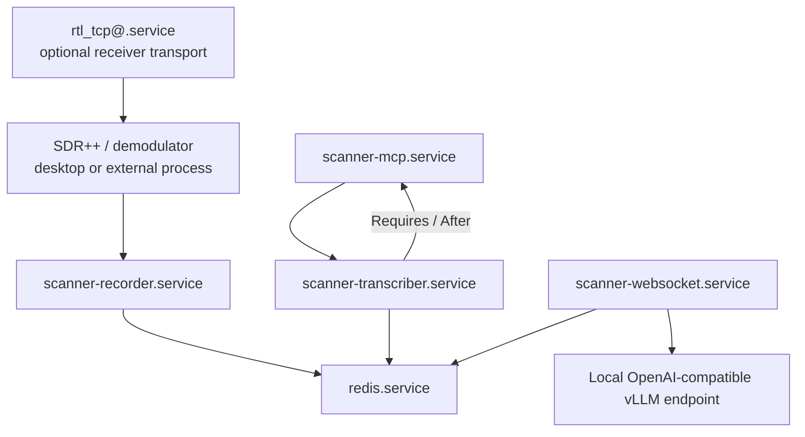

# Ned's Scanner Network: System Architecture and Call Flow

This is the implementation map for the scanner radio project as it exists in
this repository. It follows one transmission from RF/audio capture through the
website, then documents every durable store and asynchronous side path involved.

> **The shortest useful mental model**
>
> A receiver puts demodulated audio into one PulseAudio/PipeWire sink per feed.
> The recorder cuts that audio into calls and publishes file paths to Redis.
> The transcriber turns each file into clean audio, a transcript, metadata, and
> one authoritative `calls` row. The web app reads those rows. A separate,
> asynchronous intelligence layer validates and enhances individual calls,
> groups transmissions into incidents, and prepares Ned's Take.

## 1. One-screen system map

```mermaid
flowchart LR
    RF["Radio traffic"] --> RTL["RTL-SDR / rtl_tcp"]
    RTL --> RX["SDR++ or another demodulator"]
    RX --> PULSE["Pulse/PipeWire sink<br/>sdr_sink_FEED"]

    subgraph CAPTURE["Capture service"]
        PULSE --> FFMPEG["ffmpeg<br/>mono PCM"]
        FFMPEG --> SOX["sox silence splitter"]
        SOX --> STAGE["raw/FEED/.staging"]
        STAGE --> WATCH["inotify close_write"]
        WATCH --> RAW["raw/FEED/rec_TIMESTAMP_FEED.wav"]
    end

    WATCH -->|XADD| NEWCALL[("Redis stream<br/>scanner:stream:new_call")]
    WATCH -->|SET EX 10| TX[("Redis state<br/>scanner:FEED:transmitting")]
    WATCH -->|SET| LATEST[("Redis state<br/>scanner:FEED:latest_time")]

    subgraph TRANSCRIBE["Transcription services"]
        NEWCALL --> LISTENER["Redis stream listener"]
        LISTENER -->|MCP streamable HTTP| MCP["Warm MCP server"]
        MCP --> PRE["audio preprocessing"]
        PRE --> WHISPER["faster-whisper on GPU"]
        WHISPER --> QUALITY["quality scoring + rule NLP"]
    end

    QUALITY --> CLEAN["clean/FEED<br/>WAV + TXT + JSON"]
    QUALITY --> CALLS[("scanner_calls.db<br/>calls")]

    subgraph INTEL["Asynchronous scanner intelligence"]
        CALLS --> ENRICH["per-call AI enrichment<br/>and transcript validation"]
        ENRICH --> INTDB[("scanner_intelligence.db")]
        INTDB -->|qualified retry request| RETRY[("Redis stream<br/>scanner:stream:retranscribe")]
        RETRY --> LISTENER
        CALLS --> GROUP["deterministic incident grouping"]
        ENRICH --> GROUP
        GROUP --> INTDB
        GROUP --> DAILY["network + town + department<br/>Ned's Take in one pass"]
        DAILY --> INTDB
    end

    subgraph WEB["Web delivery"]
        CALLS --> API["Flask JSON and HTML routes"]
        INTDB --> API
        CLEAN --> AUDIO["/scanner/audio/FILENAME"]
        AUDIO --> BROWSER["Browser / PWA"]
        API --> BROWSER
        TX --> SOCKET["Socket.IO transmitting worker"]
        SOCKET --> BROWSER
    end

    LATEST --> PUSHWATCH["new-call watcher"]
    PUSHWATCH --> PUSHQ[("Redis list<br/>push_queue")]
    PUSHQ --> PUSH["VAPID Web Push worker"]
    PUSHDB[("push_subs.sqlite3")] --> PUSHWATCH
    PUSHDB --> PUSH
    PUSH --> BROWSER
```



The boundary before `Pulse/PipeWire sink` is deliberately replaceable. The
active recorder contract begins at the configured monitor source. SDR++ is the
normal demodulator described by this repo, but a hardware scanner, Gqrx,
network stream, or another process can feed the same sink.

## 2. One call, in exact runtime order



### Timing detail that matters

There are three different notions of “time” in this flow:

1. The raw filename contains the recorder's local wall-clock time.
2. The Redis `new_call.time` and `scanner:FEED:latest_time` values contain the
   recorder's UTC completion time.
3. The first-pass `calls.timestamp` is currently created inside the
   transcription path, so it represents when metadata was built rather than
   the original Redis capture timestamp.

The web's new-call push watcher reacts to item 2. The archive and daily
intelligence primarily query item 3. A push can therefore arrive before the
transcript is available, and a slow transcription can shift a call's database
time slightly later than its actual recording time.

## 3. Capture and Redis event contract

The active capture entry point is
`record/multi_scanner_recorder_with_redis.sh`. It loads:

- shared settings from `config/scanner_recorder.env`;
- feed definitions from `config/scanner_channels.conf`;
- optional service-level overrides from `%h/.config/scanner/env`.

Each configured feed becomes:

```text
feed tag:       fd
null sink:      sdr_sink_fd
monitor input:  sdr_sink_fd.monitor
raw directory:  $ARCHIVE_BASE/raw/fd
staging:        $ARCHIVE_BASE/raw/fd/.staging
final name:     rec_YYYY-MM-DD_HH-MM-SS_fd.wav
```

The recorder's per-feed pipeline is:

```text
Pulse monitor
  -> ffmpeg: mono, SAMPLE_RATE, signed 16-bit PCM
  -> tee: optional local aplay monitor
  -> sox: start/stop silence detection, lead padding, newfile/restart
  -> staging WAV
  -> inotify close_write
  -> atomic move/rename into raw/<feed>
```

On each completed WAV, the recorder performs these writes:

| Target | Operation | Data | Purpose |
|---|---|---|---|
| Redis | `SET scanner:<feed>:transmitting Y EX 10` | transient `Y` | Live radio indicator; expires back to quiet |
| Redis | `XADD scanner:stream:new_call` | `tag`, absolute `file`, UTC `time` | Durable-ish work event for transcription |
| Redis | `SET scanner:<feed>:latest_time` | UTC ISO timestamp | Last completed recording and push trigger |
| Filesystem | append `/tmp/transcribe_queue.txt` | absolute raw WAV path | Legacy queue/audit trail; not the active consumer |
| Filesystem | append `$ARCHIVE_BASE/logs/stats.log` | feed/hour/minute/exact time | Recorder activity statistics |
| Filesystem | recorder daily log | operational messages | Diagnostics |

### Current feed coverage

The seven fully aligned town pairs are:

| Town | Police | Fire |
|---|---|---|
| Hopedale | `pd` | `fd` |
| Milford | `mpd` | `mfd` |
| Bellingham | `bpd` | `bfd` |
| Mendon | `mndpd` | `mndfd` |
| Blackstone | `blkpd` | `blkfd` |
| Upton | `uptpd` | `uptfd` |
| Franklin | `frkpd` | `frkfd` |

There is current configuration drift beyond those feeds:

- the recorder config contains `mllpd` and `mllfd`;
- some web route lists use `milpd` and `milfd` for Millis; and
- wider web lists also mention Medway, Foxborough, and Southborough feeds that
  are not in the central MCP `FEED_KEYS`/`SOURCE_MAP`.

An unrecognized recorder tag falls through MCP category detection as `misc`.
Before enabling those feeds in production, give each town one canonical feed
ID and add it consistently to the recorder channel file, MCP feed/source map,
shared database town map, web town configuration, route validation lists, and
push channel list.

## 4. Transcription path

### Stream listener

`transcriber/transcribe_stream_listener_mcp.py` is the bridge between Redis and
the warm model server.

- Reads `scanner:stream:new_call` with `XREAD`, one message at a time.
- Resumes from Redis key `scanner:transcriber:last_id`.
- If no cursor exists, starts at `$`, meaning only new messages are consumed.
- Tracks successfully handled raw paths in `/tmp/transcribe_processed.txt`.
- Calls `transcribe_file` with artifact and database writes enabled.
- Optionally runs models listed in `SECONDARY_MODELS`; their output is appended
  to the JSON sidecar and `calls.extra.secondary_transcripts`.
- Advances `scanner:transcriber:last_id` even when a message fails. A failure is
  logged, but the primary stream is not currently an automatic retry queue.

### Warm MCP server

`transcriber/scanner_transcriber_mcp.py` keeps the selected faster-whisper
model resident and exposes tools over MCP streamable HTTP. The live endpoint is
set by `MCP_URL` in `transcriber/.env`.

For a normal call, `transcriber/mcp_routes/transcribe_with_state.py`:

1. restricts the source path to allowed roots;
2. rejects missing, too-short, or static/noise-only files;
3. infers the feed from the filename/path;
4. preprocesses into a temporary clean WAV using the selected audio profile;
5. extracts a compact, noise-floor-aware waveform envelope from that WAV;
6. runs faster-whisper under the shared GPU gate;
7. performs the built-in decoding retry/squelch checks;
8. scores transcript quality;
9. builds baseline metadata and rule-based NLP enrichment;
10. writes clean artifacts; and
11. inserts the authoritative `calls` row.

### Files created for one successful call

```text
$ARCHIVE_BASE/
├── raw/<feed>/
│   └── rec_<date>_<time>_<feed>.wav
├── clean/<feed>/
│   ├── rec_<date>_<time>_<feed>.wav
│   ├── rec_<date>_<time>_<feed>.txt
│   └── rec_<date>_<time>_<feed>.json
├── review/
│   └── <copied WAV after a transcript edit/approval>
└── logs/
    ├── stats.log
    ├── recorder_logs/
    └── transcriber_logs/
```

The raw WAV is retained because the listener requests
`delete_source_raw=false`.

## 5. Database ownership and every write path

There are two scanner databases with intentionally different authority.



### 5.1 `scanner_calls.db`: source and operational data

Default path: `/home/ned/data/scanner_calls/scanner_calls.db`  
Owner module: `shared/scanner_db.py`  
Concurrency mode: SQLite WAL for write connections.

#### `calls`

One row normally represents one silence-delimited radio transmission, not
necessarily one complete incident.

| Column group | Columns | Written or updated by |
|---|---|---|
| Identity/source | `id`, `town`, `state`, `dept`, `category`, `filename`, `json_path`, `wav_path`, `timestamp` | First-pass MCP transcription |
| Audio | `duration`, `rms` | First-pass MCP transcription |
| Transcript | `transcript`, `raw_transcript`, `normalized_transcript`, `edited_transcript` | MCP first pass; comparison retry may promote `transcript`; human edit/approval writes `edited_transcript` |
| Quality | `transcription_score`, `needs_retry`, `needs_review`, `quality_reasons`, `profile_used`, `retry_profiles_tried` | MCP scoring; accepted retry replaces relevant fields; rejected retry sets `needs_review=1` |
| Model provenance | `transcription_engine`, `transcription_model` | MCP first pass |
| Classification | `classification`, `intent_labeled`, `intent_labeled_at` | Rule NLP first pass; human intent submission/update |
| Model comparisons and UI extras | `extra` | First pass waveform envelope, optional secondary models, transcript votes, and AI retranscription candidates |
| Engagement/review | `reviewed`, `play_count`, `hook_request`, `save_for_eval`, `freeze_for_testing` | Web actions and first-pass hook detection |
| Location | `derived_address`, `derived_street`, `derived_addr_num`, `derived_town`, `derived_lat`, `derived_lng`, `address_confidence` | NLP/geocoding enrichment |
| Training | `embedding` | Reserved/offline tooling |

The first-pass write is currently `INSERT OR REPLACE` keyed by unique
`filename`. That behavior should be considered when adding foreign keys or
depending on stable row IDs.

The original transcript remains separate from:

- a human correction in `edited_transcript`;
- comparison candidates in `extra.ai_retranscriptions`; and
- the AI-enhanced display transcript in
  `scanner_intelligence.db.scanner_call_enrichments.enhanced_transcript`.

#### `user_activity_log`

Append-only audit/analytics rows written by web actions:

`id`, `timestamp`, `session_hash`, `client_id`, `ip`, `action`, `detail`.

Examples include page views, audio plays, transcript edits/approvals,
evaluation flags, intent labels, and transcript votes.

#### `client_sessions`

Created and maintained by `web/client_tracker.py` in the same database:

`id`, `client_id`, `ip`, `user_agent`, `origin`, `referrer`, `language`,
`fingerprint`, `first_seen`, `last_seen`, `geo_json`, `connection_count`.

A Socket.IO connection either inserts a fingerprint or updates `last_seen` and
increments `connection_count`.

#### Reference/location tables

These support address recognition and geocoding; they are not rewritten for
every call.

| Table | Role |
|---|---|
| `addresses` | Imported MassGIS address points and normalized address fields |
| `streets` | Distinct town/street lookup with address-number ranges |
| `geocode_cache` | Cached external geocoder results by normalized query |

### 5.2 `scanner_intelligence.db`: derived intelligence

Default path: `/home/ned/data/scanner_calls/scanner_intelligence.db`  
Owner modules: `scanner_intelligence/call_enrichment.py` and
`scanner_intelligence/daily_take.py`.

No model-generated value in this database silently becomes an observed fact.
Relations to `calls.id` are logical because SQLite cannot enforce foreign keys
across the two database files.

#### `scanner_call_enrichments`

One current AI-derived view per source call:

| Columns | Meaning |
|---|---|
| `call_id` | Logical reference to `calls.id`; primary key |
| `source_fingerprint` | SHA-256 over the exact source fields used |
| `source_timestamp`, `town`, `dept`, `category` | Source snapshot |
| `status` | `pending`, `processing`, `complete`, `failed`, or `skipped` |
| `enhanced_transcript` | Conservative cleanup shown as **AI enhanced call** |
| `factual_summary`, `commentary` | Grounded summary and optional Ned line |
| `classification_json` | Suggested call type, agency, urgency, lifecycle, outcome, continuity terms |
| `evidence_json` | Verified excerpts that must occur in the source transcript |
| `transcript_validation_json` | Plausibility status, retry decision, confidence, reasons |
| `confidence`, `model`, `prompt_version` | AI provenance |
| `attempts`, `last_error`, timestamps | Work lease/retry bookkeeping |

The source fingerprint includes call identity, source timestamp, town,
department, feed, duration, RMS, quality state, profile, selected source
transcript, and source classification. A transcript edit therefore invalidates
the old enrichment without overwriting it blindly.

#### `scanner_retranscription_requests`

Durable control plane for AI-requested comparison transcriptions:

`id`, `call_id`, `source_fingerprint`, `status`, `reasons_json`,
`explanation`, `validation_confidence`, `requested_at`, `dispatched_at`,
`completed_at`, `result_json`, `last_error`.

The pair `(call_id, source_fingerprint)` is unique. The enrichment worker only
queues a request when validation is `questionable` or `unusable`, explicitly
requests retranscription, supplies reasons, and has confidence of at least
`0.8`. At most two historical requests are allowed per call.

#### `scanner_incidents`

Deterministically grouped transmissions:

`incident_key`, `day`, town/department/feed, start/end timestamps, call type,
source count and call IDs, units, addresses, lifecycle stages, returned units,
closed state, tone flag, quality flag, notable score, and create/update times.

The daily build deletes and rebuilds the affected day's rows. These are derived
groupings, not dispatch-system incident numbers.

#### `scanner_daily_takes`

Persisted daily editions:

`day`, `town_scope`, `edition_type`, `status`, full factual pack JSON, rendered
content JSON, cited source call IDs, generation time/provenance, prompt version,
and source-watermark JSON.

- A **rolling** edition is refreshed by the background job and can be replaced.
- A **final** edition is an immutable historical snapshot once published.
- One build produces the network, every town, and every department section.
- Town order is Hopedale, Milford, then the remaining towns alphabetically.

The current watermark is:

```json
{
  "call_count": 123,
  "max_call_id": 409766,
  "max_timestamp": "2026-07-29T17:21:00"
}
```

It detects newly inserted/removed calls and a changed maximum call timestamp.
Unlike the per-call enrichment fingerprint, it does **not** currently hash
transcript edits to an existing call.

#### `scanner_incident_commentary`

Stable commentary attached to one derived incident:

`incident_key`, cited source call IDs, commentary, generated time, generator,
and prompt version.

This lets the incident page reuse already prepared commentary without asking
the browser to wait for a large daily LLM job.

### 5.3 `web/push_subs.sqlite3`: push delivery state

Table `subscriptions` contains:

`id`, unique browser `endpoint`, serialized push subscription, creation time,
and JSON `feed_prefs`.

An empty preference list means all feeds. Expired/unsubscribed endpoints are
removed after a `404`/`410`-style push failure.

### 5.4 External login database

`/home/ned/data/login/login.sqlite3` is outside the scanner call pipeline.
`web/push_db.py` reads `user_data.current_session_id` for logged-in-user
integration. It does not receive call, incident, transcript, or Ned's Take
writes.

## 6. AI enhancement and retranscription loop



The enrichment is presentation assistance, not a hidden replacement:

- the original/source transcript remains available;
- the full feed calls page orders the source and derived sections as
  **Original transcript**, **AI enhanced call**, then **Ned's Take**;
- compact homepage, archive, and review cards remain source-focused;
- when a conservative transcript validator declines to rewrite the source, the
  AI panel still presents its factual summary instead of disappearing;
- severe token/phrase loops never become enhanced text or Ned's Take; they
  display a deterministic diagnostic while the bounded comparison runs;
- the enhanced value lives in the intelligence database;
- a comparison retranscription is separately scored before it can replace
  `calls.transcript`; and
- a human edit in `edited_transcript` takes precedence when intelligence builds
  its factual input.

## 7. Incident continuity and Ned's Take

One radio transmission is often only a fragment. Grouping therefore happens
after per-call transcription, not inside the recorder.



The grouper uses same-town/service context plus anchors such as addresses,
units, call type, lifecycle language, and bounded time gaps. In particular:

- fire `back in quarters` closes the lifecycle;
- fire termination language can also close it;
- police `clear` normally ends the call;
- warnings and citations are extracted as outcomes;
- response time is only reported when dispatch/tone and an on-scene point are
  both actually heard;
- full incident span and recorded-audio duration remain separate values.

The factual grouping code runs before commentary. The local LLM receives a
bounded fact package and produces variable commentary in one request for:

1. the whole scanner network;
2. each town;
3. each town/department section; and
4. selected highlighted incidents.

The model is allowed to be sarcastic and comedic, but evidence quotes and
numeric claims are validated against the factual package. Hopedale citation
commentary can therefore react loudly when a citation is genuinely present
without inventing one.

## 8. Web delivery

### Completed calls

The Flask app reads `scanner_calls.db` for call cards, town pages, archive
pages, stats, search, and the call permalink. Audio is served from the clean
archive. The main browser periodically polls:

- `/scanner/api/home_live_calls`;
- `/scanner/api/latest`;
- `/scanner/api/today_counts`;
- `/scanner/api/archive_calls`; and
- related page-specific APIs.

Common call API results are warmed in process and in Redis under
`scanner_api_cache:*`, with TTLs of roughly 10–30 seconds depending on the
payload. The cache warmer runs every 20 seconds.

Each call payload exposes the 512-point waveform envelope once at its top
level. The browser draws those stored peaks immediately and recolors them as
playback advances. Older calls without stored peaks retain the Web Audio
decode-on-play fallback. `scripts/backfill_waveforms.py` can populate archived
clean WAVs without holding SQLite's writer lock while audio is analyzed.

### Live transmitting state

`web/sockets.py` polls `scanner:*:transmitting` between four times per second
while active and once per second while quiet. It emits changed feed states as
Socket.IO `transmitting_update` events. This drives the live bar and feed
indicators; it is not the authoritative completed-call transport.

The current browser code contains listeners for `initial_time_snapshot` and
`latest_time_update`, but the active server worker does not emit those events.
Completed call cards remain polling/API driven.

### Ned's Take and incidents

- Opening the drawer fetches `/scanner/api/neds-take?date=today`.
- The full report fetches the same endpoint for a selected day.
- Incident pages fetch `/scanner/api/incident/<incident_key>/take`.
- These responses set `Cache-Control: no-store, max-age=0` and `Pragma:
  no-cache`.
- Browser requests read prepared editions and do not wait on the LLM.
- The scheduler refreshes the rolling take every five minutes.
- At 12:10 AM local time, yesterday is written as a final edition after late
  calls have had time to settle.

### Push notifications



Push says “New call recorded” because it is triggered at raw recording
completion. It does not imply that the clean audio, transcript, enrichment, or
incident grouping has completed.

### User-originated writes

| Browser action | Durable change |
|---|---|
| Play audio | increment `calls.play_count`; set Redis `scanner:play_count:<filename>`; append activity log |
| Edit/approve transcript | set/clear `calls.edited_transcript`; copy WAV into review directory; append activity log |
| Submit intent/disposition | update `calls.classification`, `intent_labeled`, `intent_labeled_at`; append activity log |
| Vote for transcript/model | update `calls.extra.best_transcript_vote`; append activity log |
| Mark evaluation/testing | update `save_for_eval` or `freeze_for_testing`; append activity log |
| Toggle hook request | update `calls.hook_request`; append activity log where routed |
| Connect via Socket.IO | insert/update `client_sessions` |
| Browser heartbeat | update in-memory active-listener registry only |
| Subscribe to push | insert/update `push_subs.sqlite3.subscriptions` |

## 9. Redis inventory

| Redis name | Type | Producer | Consumer | Retention behavior |
|---|---|---|---|---|
| `scanner:stream:new_call` | Stream | Recorder | Transcriber listener | No trimming is configured here |
| `scanner:transcriber:last_id` | String | Transcriber | Transcriber startup | Persists last primary stream cursor |
| `scanner:stream:retranscribe` | Stream | Intelligence dispatcher | Transcriber listener | Separate comparison-work stream |
| `scanner:transcriber:retranscribe:last_id` | String | Transcriber | Transcriber startup | Persists retry stream cursor |
| `scanner:<feed>:transmitting` | String | Recorder | Socket.IO worker | `Y`, expires after 10 seconds |
| `scanner:<feed>:latest_time` | String | Recorder | Push watcher and time API | Last write wins |
| `push_queue` | List | Push watcher/API | Push worker | Jobs removed with `BRPOP` |
| `scanner_api_cache:<key>` | String/JSON | Web cache warmer/routes | Web routes | TTL depends on API |
| `scanner:api:stats` | String/JSON | Stats scheduler | Stats consumers | Replaced on each calculation |
| `scanner:play_count:<filename>` | String | Play endpoint | Auxiliary consumers | No TTL in current route |

## 10. Service topology



| Service | Entry point | Responsibility |
|---|---|---|
| `scanner-recorder.service` | `record/multi_scanner_recorder_with_redis.sh` | Pulse capture, segmentation, raw archive, Redis events |
| `scanner-mcp.service` | `transcriber/scanner_transcriber_mcp.py` | Warm Whisper model and MCP tools |
| `scanner-transcriber.service` | `transcriber/transcribe_stream_listener_mcp.py` | Primary/retry stream consumption and MCP calls |
| `scanner-websocket.service` | `web/app_socket2.py` | Flask, APIs, Socket.IO, schedules, push workers |
| `rtl_tcp@.service` | `/home/ned/scripts/rtl_wrapper.sh` | Optional one-port-per-dongle RTL transport |

The current web service unit does not declare the scanner `.env` files used by
the recorder/transcriber units. Web configuration therefore comes from its
process environment and code defaults unless another launch layer supplies it.

## 11. Background schedules

| Job/worker | Frequency | Reads | Writes/emits |
|---|---:|---|---|
| Transmitting worker | 0.25–1 second | Redis transmitting keys | Socket.IO state changes |
| New-call push watcher | 5 seconds | Redis latest times; push DB | `push_queue` |
| Push worker | blocking | `push_queue`; push DB | External Web Push; deletes dead subscriptions |
| Scanner stats | 10 seconds | filesystem, call DB, active listeners | `scanner:api:stats`; `stats_update` |
| API cache warmer | 20 seconds | call DB | memory + `scanner_api_cache:*` |
| Per-call intelligence job | 1 minute, six calls by default | call DB, intelligence DB, local LLM | enrichments and bounded retry requests |
| Ned's Take rolling job | 5 minutes | call DB, intelligence DB, local LLM | incidents and rolling network/town/department daily take |
| Final daily edition | 12:10 AM | prior-day calls/intelligence | immutable prior-day final take |
| Browser call board | about 30 seconds | Flask APIs | DOM only |

The web process sends blocking scheduler bodies through Eventlet's native
thread pool. AI inference and database preparation therefore do not occupy the
cooperative request loop that serves HTTP, heartbeats, and Socket.IO clients.
Jobs coalesce missed runs and allow a configurable scheduling grace period.

## 12. Failure and recovery behavior

| Failure | Current behavior |
|---|---|
| Pulse source missing at service start | Recorder service waits up to about 30 seconds, exits, then systemd restarts on failure |
| Redis unavailable during recorder's background writes | WAV remains on disk; individual Redis commands may fail; the legacy text queue still receives the path |
| Primary stream file missing or MCP call fails | Error is logged; primary cursor still advances; manual replay/requeue may be required |
| Listener restarts | Resumes from Redis cursor and skips paths in processed file |
| MCP restarts | systemd restarts it; transcriber requires/starts after MCP |
| SQLite busy | shared DB insertion retries three times with incremental delay; WAL reduces reader/writer contention |
| Per-call LLM batch fails | Work is released back to pending and can retry; repeated failed rows stop after bounded attempts |
| Enrichment becomes stale | Fingerprint mismatch hides it and makes the call eligible for regeneration |
| Retranscription candidate is not clearly better | Original remains; candidate is retained in `calls.extra`; call is flagged for review |
| Daily LLM commentary JSON is empty/truncated | Retry once with a larger output budget and terser prompt; deterministic factual take remains if that retry also fails |
| Rolling daily source watermark changes | Cached rolling edition is considered stale/rebuilt by the scheduled path |
| Final edition already exists | It is returned unchanged as historical record |
| Browser cache holds a Ned response | Prevented by no-store/no-cache response and request headers |
| Push endpoint expires | Failed endpoint is removed from the subscription DB |

## 13. Repository map

| Path | Why it matters |
|---|---|
| `config/scanner_channels.conf` | Active recorder feed-to-sink definitions |
| `config/scanner_recorder.env` | Capture paths and silence thresholds |
| `record/multi_scanner_recorder_with_redis.sh` | Actual multi-feed recorder |
| `transcriber/transcribe_stream_listener_mcp.py` | Redis consumer and comparison retry worker |
| `transcriber/scanner_transcriber_mcp.py` | Warm model MCP application |
| `transcriber/mcp_routes/transcribe_with_state.py` | End-to-end first-pass transcription |
| `transcriber/mcp_functions/transcribe_wavefile.py` | faster-whisper inference, adaptive decoding retry, squelch gate |
| `transcriber/mcp_tools/scoring.py` | Transcript quality rules |
| `transcriber/nlp_zero_shot.py` | Rule-based first-pass metadata enrichment |
| `shared/scanner_db.py` | Source database schema and write helpers |
| `scanner_intelligence/call_enrichment.py` | AI-enhanced call and retranscription request lifecycle |
| `scanner_intelligence/daily_take.py` | Lifecycle detection, incident grouping, editions, watermarks |
| `chatbot/app.py` | Local-LLM prompts and output validation |
| `web/app_socket2.py` | Web app composition, schedulers, stats |
| `web/sockets.py` | Live status and Web Push workers |
| `web/routes/routes_scanner.py` | Scanner pages, call APIs, editing/review actions |
| `web/routes/routes_chat.py` | Chat, no-store Ned's Take, and incident APIs |
| `web/push_db.py` | Push subscription persistence |
| `web/templates/scanner_call.html` | Source and AI-enhanced call presentation |
| `web/templates/scanner_incident.html` | Incident evidence page shell |
| `web/templates/scanner_neds_take.html` | Full daily report |
| `web/static/js/scanner_app_new.js` | Homepage call board, live bar, Ned drawer |
| `user_services/` | systemd user units |

## 14. Operator trace: “Where did this call stop?”

Use the call's feed and raw filename to walk this checklist in order:

1. **Pulse:** does `sdr_sink_<feed>.monitor` exist and carry audio?
2. **Raw file:** did a non-staging WAV appear under
   `$ARCHIVE_BASE/raw/<feed>/`?
3. **Recorder event:** does the recorder log show `saved <filename>`?
4. **Redis stream:** does `scanner:stream:new_call` contain the raw path?
5. **Listener:** did `stream_listener_mcp.log` report `New call`, then `Done`?
6. **Clean artifacts:** do matching WAV/TXT/JSON files exist under
   `$ARCHIVE_BASE/clean/<feed>/`?
7. **Source DB:** is there a `calls` row with the matching `filename`?
8. **Web API:** does `/scanner/api/archive_calls?feed=<feed>&offset=0&limit=10`
   include it after the short cache window?
9. **Per-call AI:** is `scanner_call_enrichments.status='complete'` after the
   next five-minute intelligence cycle?
10. **Incident:** does the next daily build include its call ID in
    `scanner_incidents.source_call_ids_json`?
11. **Ned's Take:** does the rolling edition's `source_watermark_json` advance
    and cite the call if selected as a highlight?

## 15. Architectural rules worth preserving

1. **Raw audio is evidence.** Do not discard it merely because clean audio and
   a transcript exist.
2. **`calls` is authoritative.** AI suggestions belong in the intelligence
   database until a separately defined promotion rule says otherwise.
3. **Display provenance.** Keep “Original transcript” and “AI enhanced call”
   visibly distinct.
4. **Group deterministically, joke afterward.** Incident membership, timing,
   closure, and outcomes should not depend on a creative LLM response.
5. **Use separate work channels.** New-call transcription and AI-requested
   comparison transcription have different streams and different overwrite
   rules.
6. **Never make the browser wait for the day's LLM job.** Prepare rolling
   editions in the background; use no-cache reads for freshness.
7. **Keep final editions immutable.** History should remain the version that
   was actually published for that day.

---

Related focused document:
[`docs/neds_take_lifecycle.md`](neds_take_lifecycle.md) covers the incident
grouping and daily-edition design in greater depth.
